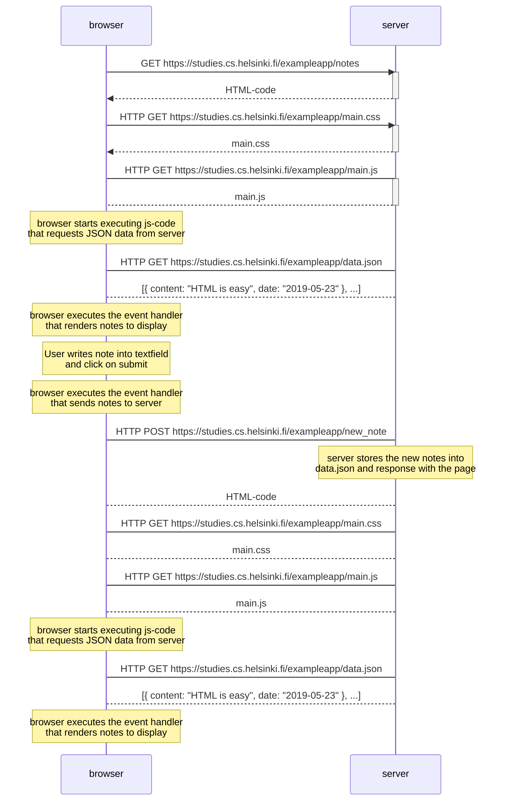

```mermaid
sequenceDiagram
    participant browser
    participant server

    browser->>server: GET https://studies.cs.helsinki.fi/exampleapp/notes
    activate server
    server-->>browser: HTML-code
    deactivate server
    browser->>server: HTTP GET https://studies.cs.helsinki.fi/exampleapp/main.css
    activate server
    server-->>browser: main.css
    deactivate server
    browser->server: HTTP GET https://studies.cs.helsinki.fi/exampleapp/main.js
    activate server
    server-->browser: main.js
    deactivate server

    note over browser: browser starts executing js-code<br/>that requests JSON data from server

    browser->server: HTTP GET https://studies.cs.helsinki.fi/exampleapp/data.json
    server-->browser: [{ content: "HTML is easy", date: "2019-05-23" }, ...]
    
    note over browser: browser executes the event handler<br />that renders notes to display
    
    note over browser: User writes note into textfield<br />and click on submit
    
    note over browser: browser executes the event handler<br />that sends notes to server
    
    browser->server: HTTP POST https://studies.cs.helsinki.fi/exampleapp/new_note
    
    note over server: server stores the new notes into<br />data.json and response with the page
    
    server-->browser: HTML-code
    browser->server: HTTP GET https://studies.cs.helsinki.fi/exampleapp/main.css
    server-->browser: main.css
    browser->server: HTTP GET https://studies.cs.helsinki.fi/exampleapp/main.js
    server-->browser: main.js
    
    note over browser: browser starts executing js-code<br />that requests JSON data from server
    
    browser->server: HTTP GET https://studies.cs.helsinki.fi/exampleapp/data.json
    server-->browser: [{ content: "HTML is easy", date: "2019-05-23" }, ...]
    
    note over browser: browser executes the event handler<br />that renders notes to display
```
